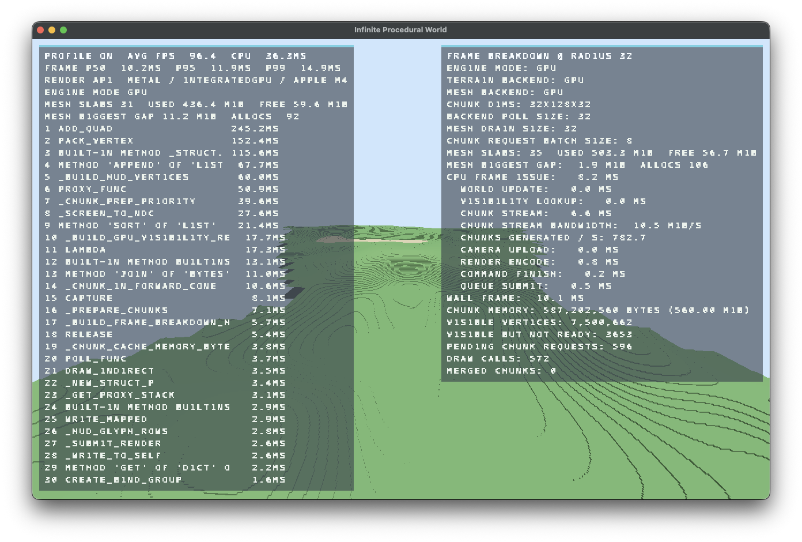

# Infinite Procedural World

A real-time voxel terrain renderer built in Python on top of `wgpu-py`, with deterministic procedural generation, pluggable CPU/GPU terrain backends, GPU meshing, GPU-driven visibility culling, indirect draw submission, and an in-engine profiling HUD.

## Screenshots

| CPU path | GPU path |
| --- | --- |
|  |  |

## Overview

This project is a renderer-first voxel terrain tech demo focused on frame-time decomposition and architecture exploration rather than gameplay systems.

The world is chunked in the X/Z plane, generated deterministically from `(seed, chunk_x, chunk_z)`, and streamed on demand as the camera moves. The renderer supports both CPU and GPU execution paths for terrain generation and meshing, and includes internal tooling to benchmark chunk throughput, batch sizing, frame breakdown, and render capacity.

## Core technical features

- Infinite procedural terrain with deterministic sampling
- Chunk size `32 x 128 x 32`
- CPU terrain backend
- GPU terrain backend slot with compute-based chunk generation path
- CPU voxel meshing path
- GPU voxel meshing path
- GPU visibility culling using per-mesh bounding spheres
- GPU indirect draw command generation
- Persistent mesh slab allocator for chunk vertex storage
- Chunk cache with eviction and reuse
- Optional merged render batches for distant terrain
- Real-time profiling HUD and frame breakdown overlay
- Benchmark harness for terrain throughput, render scaling, and validation

## Runtime model

### World representation

The terrain is infinite in X/Z and vertically capped at `128` blocks. Surface generation is deterministic and driven from a compact procedural height/material sampler. Chunk requests are resolved lazily and cached once meshed.

### Terrain backends

`VoxelWorld` is a façade over a swappable terrain backend:

- `CpuTerrainBackend`: computes chunk surface grids and voxel grids on CPU
- `MetalTerrainBackend`: dedicated GPU backend slot using the current compute path as a placeholder for a future native Metal-oriented implementation

Both backends expose the same chunk-surface and chunk-voxel interfaces, so renderer-side scheduling does not depend on the generation path.

### Meshing paths

Two meshing strategies exist:

- **CPU meshing** using Numba-accelerated kernels
- **GPU meshing** using compute shaders for voxel-face counting, prefix/scan, and vertex emission

The GPU path builds mesh data asynchronously and finalizes chunk meshes into renderer-managed vertex storage.

### Render path

The render loop uses `wgpu-py` and a custom WGSL pipeline:

1. Update camera and visible chunk set
2. Stream/generate missing chunks
3. Build or finalize chunk meshes
4. Upload camera uniform
5. Build visibility records for resident meshes
6. Run GPU visibility culling
7. Emit indirect draw commands
8. Submit render pass
9. Overlay profiling HUD

## Renderer architecture

### Chunk streaming

The renderer tracks visible chunk coordinates around the camera and schedules chunk preparation with bounded request budgets. Chunk generation is demand-driven and decoupled from visibility checks so the frame loop can trade chunk latency against frame stability.

### Chunk cache

Chunk meshes are stored in an ordered cache keyed by `(chunk_x, chunk_z)`. Cached meshes include:

- GPU vertex buffer handle
- vertex count
- chunk-space bounds
- allocation metadata
- creation timestamp

### Mesh storage allocator

Chunk mesh output is not stored as one buffer per chunk by default. Instead, the renderer maintains persistent mesh output slabs and suballocates aligned regions from them. This reduces churn from per-chunk buffer creation and enables reuse of large GPU allocations.

Tracked allocator state includes:

- slab count
- used bytes
- free bytes
- largest free range
- live allocation count

### GPU visibility culling

Resident chunk meshes carry bounding spheres derived from chunk center and max height. These bounds are uploaded into a visibility-record buffer, and a compute pass tests them against the camera frustum. Surviving meshes write indirect draw commands; rejected meshes write zero-vertex commands.

This keeps visibility classification on GPU and reduces CPU-side draw filtering overhead.

### Indirect draw path

The renderer supports indirect draw command buffers, allowing GPU-generated visibility results to flow directly into submission. This reduces CPU work when many chunk meshes are resident.

### Profiling overlays

Two HUDs are built into the engine:

- **Profiler HUD**: frame stats, top CPU hotspots, backend labels, allocator state
- **Frame breakdown HUD**: averaged timings for world update, visibility lookup, chunk streaming, camera upload, render encode, command finish, queue submit, draw calls, visible vertices, pending chunk requests, and chunk memory

## Procedural generation

Terrain sampling is based on layered 2D value noise with broad, ridge, and detail components. Surface material is derived from sampled height bands and local detail thresholds.

Current material palette includes:

- bedrock
- stone
- dirt
- grass
- sand
- snow

For voxel expansion, the surface layer is converted into full chunk voxel occupancy/material grids, then meshed either on CPU or GPU.

## Shader pipeline

The project includes several WGSL stages:

- terrain surface generation compute shader
- voxel surface expansion compute shader
- voxel mesh count / scan / emit compute shaders
- mesh visibility compute shader
- terrain render shader
- HUD render shader

The main terrain render shader performs camera-relative projection in shader code and shades fragments using a directional light.

## Benchmarks and validation

`benchmark_chunk_generation.py` includes tooling for:

- surface-grid throughput measurement
- chunk mesh build latency measurement
- terrain batch-size sweeps
- frame-mode isolation tests
- render-capacity search by chunk radius
- terrain backend validation
- GPU timestamp-assisted render timing where supported

This makes the repo useful both as a renderer demo and as a profiling/optimization sandbox.

## Repo layout

### `main.py`
Minimal entry point that creates `TerrainRenderer` and starts the render loop.

### `renderer.py`
Main engine loop, input, camera, chunk streaming, cache management, GPU meshing orchestration, visibility culling, indirect rendering, slab allocation, and profiling HUDs.

### `voxel_world.py`
World façade exposing deterministic terrain queries and backend routing.

### `cpu_terrain_backend.py`
CPU implementation of surface-grid and voxel-grid generation, with batched request/poll interfaces.

### `metal_terrain_backend.py`
GPU terrain backend slot using compute-driven chunk generation through `wgpu-py`.

### `terrain_kernels.py`
Numba-accelerated terrain kernels for noise sampling, surface generation, voxel expansion, and CPU mesh construction.

### `terrain_backend.py`
Backend protocol and shared result dataclasses.

### `benchmark_chunk_generation.py`
Microbenchmark and validation harness for terrain, meshing, and render throughput studies.

## Build and run

```bash
pip install -r requirements.txt
python3 main.py
````

## Dependencies

```txt
wgpu
rendercanvas
glfw
numpy
numba
```

## Controls

* `WASD` or arrow keys — move horizontally
* `X` — move up
* `Z` — move down
* `Right Shift` — sprint
* Left mouse drag — look around
* `F3` — toggle profiling HUD
* `R` — regenerate world with a new seed

## Current focus

This demo is primarily a sandbox for investigating voxel-engine bottlenecks such as:

* terrain generation throughput
* chunk streaming latency
* CPU vs GPU meshing tradeoffs
* draw-call pressure
* visibility-culling cost
* chunk memory pressure
* frame issue time vs wall-frame time
* transition from CPU-bound to GPU-bound rendering

## Notes

* Default engine mode is configured in code and currently targets the GPU path
* The GPU terrain backend is intentionally isolated behind a backend interface
* GPU meshing falls back to CPU meshing if required compute pipelines cannot be created
* The project is designed for iteration and profiling, so internal instrumentation is part of the runtime design
