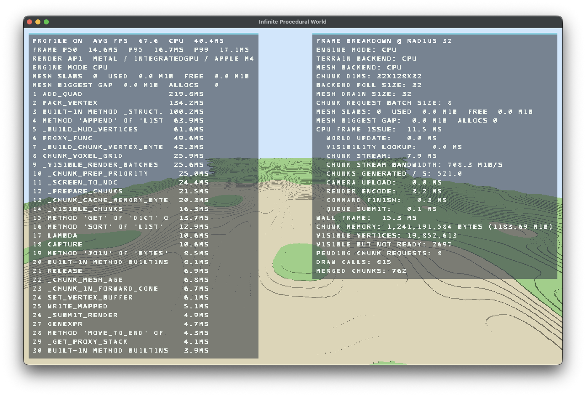
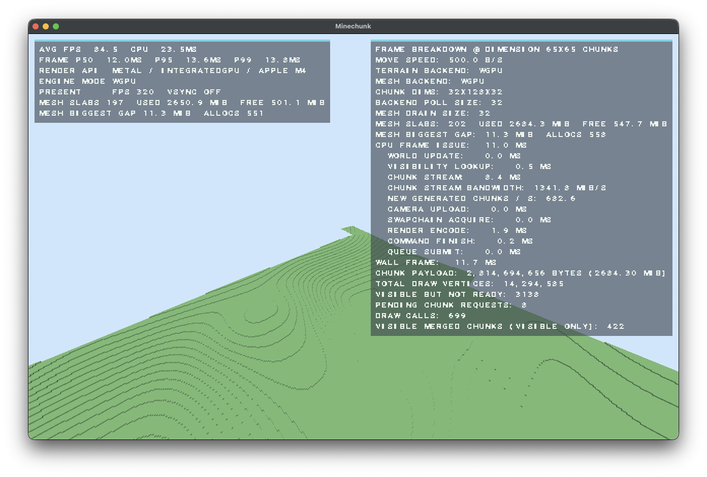
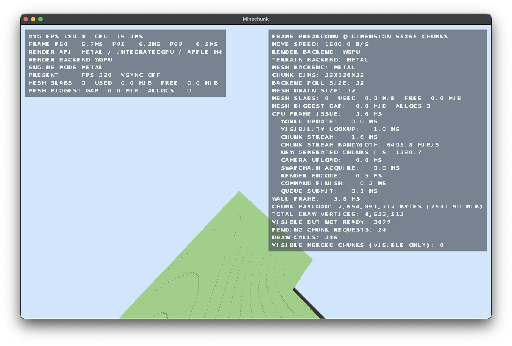

# Minechunk

Minechunk is a chunk-streamed voxel terrain engine implemented in Python on top of `wgpu-py`. The codebase is organized around deterministic terrain synthesis, explicit chunk residency, meshing, visibility culling, and indirect draw submission. It is a measurement-oriented engine, not a simplification showcase.

The checked-in configuration currently sets `engine_mode = ENGINE_MODE_METAL` in `engine/renderer_config.py`. On macOS with `pyobjc-framework-Metal` installed, terrain generation and meshing use Metal. If Metal is unavailable, Minechunk automatically falls back to `wgpu` terrain, then to CPU terrain if no GPU terrain backend can be created.

## Engine Specification

- Chunk dimensions: `32 x 128 x 32`
- Chunk surface sample footprint: `34 x 34`
- Default render radius: `32` chunks (`1,024` blocks)
- Default visible square: `65 x 65` chunks (`4,225` chunk slots)
- Default mesh cache capacity: `4,225` chunks
- Terrain model: deterministic heightfield with voxel column expansion
- Render submission: indirect draws with GPU visibility culling
- Profiling: built-in HUD plus frame breakdown overlay
- Movement: free-flight camera with sprint scaling

The default residency envelope is a `65 x 65` chunk square. The cache capacity is sized to hold that envelope.

## Measured Performance

All figures below were recorded on an Apple M4 system using the CPU backend with profiling enabled.

Profiling overhead is substantial. The profiler materially slows the engine and lowers the observed frame-time and chunk-throughput numbers. Treat the values below as profiled measurements, not unprofiled ceilings, and do not compare them directly against unprofiled runs.

| Scenario | Motion / Load | Result |
| --- | --- | --- |
| End-to-end chunk streaming, meshing, and rendering | Flying at approximately `1.5k blocks/s` | Approximately `550 chunks/s`, `P99 4.7 ms` |
| Saturated visible set | Standing in a fully loaded `65 x 65` chunk field | `P99 36.2 ms` |

These numbers describe the CPU backend path, not a GPU-terrain-only configuration.

## Pipeline

`draw_frame()` is the top-level frame graph. The order is fixed:

1. Pointer events update yaw and pitch through `_handle_pointer_move()`, while `self._update_camera(dt)` integrates free-flight motion from the current key state and clamps camera height to `[4.0, world.height + 48.0]`.
2. `chunk_gen.refresh_visible_chunk_set(self)` recomputes `_visible_chunk_origin`, `_visible_chunk_coords`, and `_visible_chunk_coord_set` when the camera crosses a chunk boundary. The visible envelope is a square of `(2 * chunk_radius + 1)^2` chunk coordinates, which is `65 x 65` at the default radius of `32`.
3. `_submit_render()` writes the 80-byte camera uniform, then builds either `mesh_cache.visible_render_batches(self, encoder)` or `mesh_cache.visible_render_batches_indirect(self, encoder)` depending on indirect-draw support. When `use_gpu_visibility_culling` is enabled and `_mesh_output_slabs` is non-empty, the renderer also dispatches `mesh_visibility_pipeline` in workgroups of `GPU_VISIBILITY_WORKGROUP_SIZE = 64` to populate `_mesh_draw_indirect_buffer`.
4. The render pass binds `camera_bind_group`, sets the vertex buffer for each visible batch, and issues either `draw()`, `draw_indirect()`, or `multi_draw_indirect()` depending on backend support and command batching.
5. `hud_profile.draw_profile_hud(self, encoder, color_view)` and `hud_profile.draw_frame_breakdown_hud(self, encoder, color_view)` append the profiler overlays into the same command buffer before submission.
6. `encoder.finish()` and `self.device.queue.submit([command_buffer])` present the frame. `swapchain_acquire_ms` is measured separately because drawable acquisition can stall independently of command encoding.
7. `chunk_gen.service_background_gpu_work(self)` reclaims deferred GPU buffers, processes deferred mesh-output frees, and finalizes pending GPU mesh batches when `use_gpu_meshing` is enabled.
8. `chunk_gen.prepare_chunks(self, dt)` pulls ready `ChunkVoxelResult` records from the active terrain backend, sorts them by `chunk_prep_priority()` `(distance_sq, abs(dz), abs(dx))`, then drains them in batches capped by `mesh_batch_size`. On the default CPU path, each record is handed to `accept_chunk_voxel_result()`, which routes through `make_chunk_mesh_from_voxels()` and the CPU meshing helpers when GPU meshing is disabled; on `wgpu` or Metal terrain paths, the batch is forwarded to `wgpu_mesher.make_chunk_mesh_batch_from_voxels()`. The resulting `ChunkMesh` objects are stored into the ordered chunk cache.
9. The request queue is rebuilt from `_visible_missing_coords` in Chebyshev rings around the current chunk origin, then drained in bounded batches. The per-frame request budget is `min(missing_count, max(1, min(chunk_prep_request_budget_cap, mesh_batch_size * 2, 32)))`, which defaults to `2` in CPU mode.
10. Frame-breakdown samples are recorded for `world_update`, `visibility_lookup`, `chunk_stream`, `chunk_stream_bytes`, `chunk_displayed_added`, `camera_upload`, `swapchain_acquire`, `render_encode`, `command_finish`, `queue_submit`, `wall_frame`, `draw_calls`, `merged_chunks`, `visible_vertices`, `visible_chunk_targets`, `visible_chunks`, and `pending_chunk_requests`.

The implementation uses shared mesh slabs, suballocated mesh-output buffers, and explicit allocation metadata instead of per-chunk buffer churn. That keeps residency stable under sustained streaming pressure and makes the allocator behavior visible to the profiler.

## Terrain Backends

`VoxelWorld` exposes the terrain source through a backend facade:

- `CpuTerrainBackend` is the reference implementation and the default checked-in path.
- `WgpuTerrainBackend` generates terrain data via `wgpu` compute passes.
- `MetalTerrainBackend` is a native Metal backend for macOS via PyObjC.

Terrain is deterministic and heightfield-driven. Surface height and top material are sampled from layered 2D value noise, then expanded into voxel columns. This engine does not attempt to hide terrain cost behind aggressive simplification.

## Explicit Non-Goals

The following are intentionally not implemented:

- Greedy meshing
- Level of detail
- Geometry simplification

These are excluded by design to keep the visual output honest and to preserve raw geometry-generation and presentation cost as measured quantities.

## Future Features

The following items are planned future work and are not part of the current engine contract:

- Native Metal renderer execution path (terrain generation and chunk meshing on Metal are already implemented)
- Baked ambient occlusion
- Screen-space ambient occlusion
- Screen-space volumetric lighting
- Exponential squared fog

The remaining Metal roadmap item is renderer execution on Metal so the entire terrain-to-frame path can run without the `wgpu` presentation renderer. The rendering features above are listed as separate passes and effects so their costs remain independently measurable.

## Repository Layout

- `main.py`: root entry point that starts `engine.renderer.TerrainRenderer`
- `engine/`: runtime package containing the renderer, backends, mesh cache, shaders, and helpers
- `benchmark_chunk_generation.py`: root-level terrain validation and benchmark harness
- `docs/`: captured screenshots for the CPU, Wgpu, and Metal demos
- `res/`: bundled HUD font asset

## Build And Run

```bash
python3 -m pip install -r requirements.txt
python3 main.py
```

To enable the default checked-in Metal mode on macOS:

```bash
python3 -m pip install pyobjc-framework-Metal
```

Backend selection lives in `engine/renderer_config.py` via `engine_mode`:

- `ENGINE_MODE_CPU`
- `ENGINE_MODE_WGPU`
- `ENGINE_MODE_METAL`

Current checked-in default:

- `engine_mode = ENGINE_MODE_METAL`

If the preferred backend cannot be created, the terrain facade falls back to an available backend and prints a warning.

## Benchmark Harness

The benchmark script measures terrain throughput, validates backend parity, sweeps batch sizes, and collects frame-time statistics when timestamp queries are available.

```bash
python3 benchmark_chunk_generation.py
```

The harness is intended for controlled comparisons between backend choices, cache sizes, batch sizes, and render-radius settings.

## Controls

- `WASD` or arrow keys: move horizontally
- `X`: move up
- `Z`: move down
- `Shift`: sprint and fly faster
- Left mouse drag: look around
- `F3`: toggle profiling HUDs
- `R`: regenerate the world with a new seed

## Captures

| CPU | Wgpu | Metal |
| --- | --- | --- |
|  |  |  |
